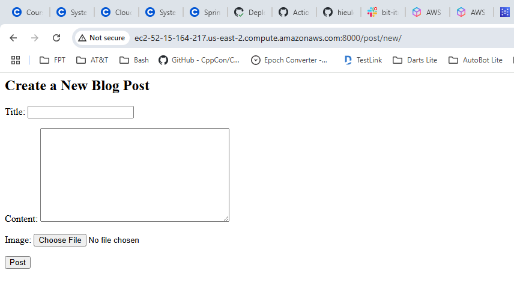
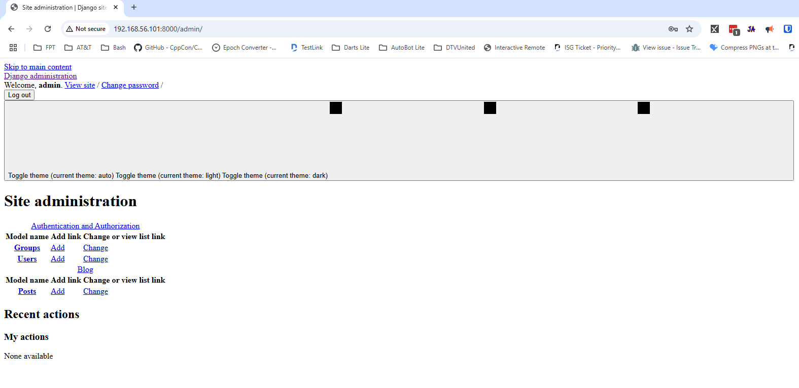
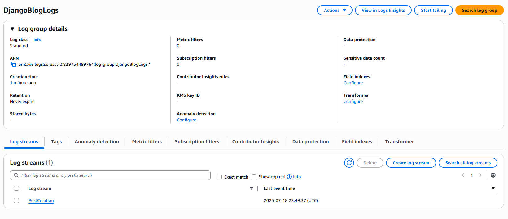
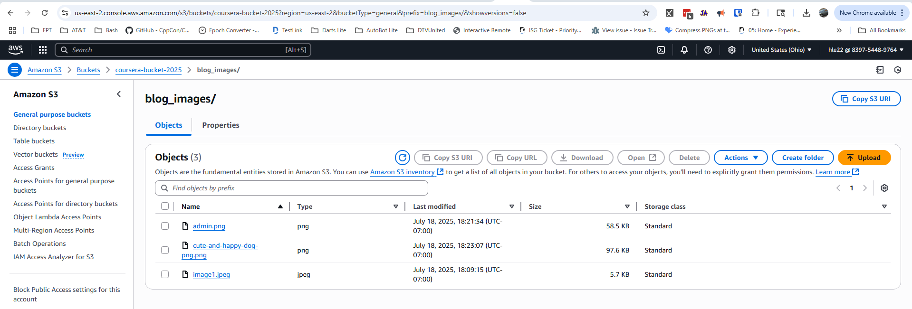

# Django Blog Project

## Description
This project sets up a Django environment with automated Git opertations.

## Setup
Setting up Environment in for Django Application

### Step 1: Install Python
To verify if Python is installed and to check the version, run the following
```bash
python3 --version
```

If Python is not installed or you need to install the latest version, run:
```bash
sudo apt update
sudo apt install python3
```

### Step 2: Install pip (Python package installer)
To install pip3, run the following command:
```bash
sudo apt install python3-pip
```
Verify the installation by checking the pip version:
```bash
pip3 --version
```

### Step 3: Install virtualenv to create a virtual environment
Virtual environments are useful for isolating project dependencies. Install virtualenv by running:
```bash
sudo apt install python3-venv
```

### Step 4: Create a virtual environment
Navigate to the directory where you want to set up your Django project and create a virtual environment:
```bash
cd /path/to/your/project
python3 -m venv myenv
```
Here, myenv is the name of the virtual environment. You can name it anything you like.

### Step 5: Activate the virtual environment
Activate the virtual environment using the following command:
```bash
source myenv/bin/activate
```
Once the virtual environment is activated, you should see the environment name (myenv) at the beginning of the command prompt.

To deactivate it later, simply run:
```bash
deactivate
```

### Step 6: Install Django in the virtual environment
With the virtual environment activated, you can now install Django using pip:
```bash
pip install django
```
Verify the installation by checking the Django version:
```bash
django-admin --version
```

## Setup and Deployment
Example
1. Clone the repository
2. Install dependencies: `pip install -r requirements.txt`
3. Run migrations: `python manage.py migrate`
4. Create a superuser: `python manage.py createsuperuser`
5. Run the development server: `python manage.py runserver`
## Docker Deployment
Example
1. Build the Docker image: `docker-compose build`
2. Run the Docker containers: `docker-compose up -d`

## EC2 Deployment
Example
1. SSH into your EC2 instance
2. Pull the latest changes: `git pull origin main`
3. Rebuild and restart Docker containers: `docker-compose up --build -d`


## Screenshots
1. EC2 Blog Post Form with record insertion:


1. Admin Interface:


1. CloudWatch Logs:


1. S3 Bucket with Uploaded Image from AWS console:

 
1. Your commits 


## Usage
- Execute the `my_script.sh` then enter the commit message to automated git commit and push to git repository.
- Configure AWS environment with `aws configure` - region: us-east-2 or change the script to your region
- Run `create_rds_instance.sh` and wait to get back the RDS instance id
- Update blog_project/settings.py and docker-compose.yml with RDS instance id
- Run python manage.py migrate
- Create EC2 instance
- Then commit and push, it will trigger the github workflow
